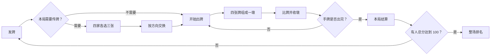

# 一局牌如何流动

红心大战的核心不是“谁出得最大”，而是玩家在信息不完整时持续管理风险：避开红桃与黑桃 Q、制造缺门、判断别人是否准备射月，并决定什么时候该赢、什么时候该输。

## 整局节奏

## 发牌与传牌：先给策略空间

每人拿到 13 张牌。手牌会按花色和点数整理，让玩家先看清自己的风险结构，而不是先处理杂乱的视觉负担。

传牌方向按“左、右、对家、不传”循环。这个循环避免每局都用同一种防守方式：有时要把危险牌送给左手，有时要为自己制造某一门的空缺，有时则必须原样承受手牌结构。

传牌阶段要求每位玩家选择三张牌；所有人完成后才统一交换。牌不会悄悄消失，而是以三张一组从发送方飞往接收方，本家收到的牌会被标记并短暂高亮，帮助玩家建立“我从哪里得到这张牌”的记忆。

## 出牌：限制不是阻碍，是推理基础

红心大战的策略来自可预测的规则边界：

- 第一墩必须由梅花 2 开始，保证所有玩家共享一个确定的开局。
- 有领出花色时，手里有该花色就必须跟牌。
- 红桃未破时，不能主动领红桃；只有无牌可出时才允许例外。
- 第一墩不应主动丢分牌，除非手中只剩分牌可出。

所有限制都由服务端判定。客户端同时用灰化和提示说明当前状态：这既减少误点，也保证网络延迟或不同设备不会改变规则结果。

## 收墩：先看懂赢家，再看到牌离开

四张牌落桌后，牌桌不会立刻清空。它依次经历：

1. 最大牌获得高亮与“最大”提示；
2. 四张牌向赢家牌靠拢；
3. 整叠朝赢家座位飞出并淡出；
4. 分数与下一位领牌者更新。

这段停顿不是装饰。它让玩家在高速牌局中确认“这一墩为什么是他拿走”，也让收分、躲分和截胡这些决策有可读的结果。

## 甩牌与最后一张自动出牌

甩牌是一个终局加速机制：玩家必须已取得牌权、剩余手牌为同一花色，且其他三家都无法跟该花色。系统先展示确认，而不是自动替玩家做决定，避免把高风险操作伪装成便利功能。

当玩家只剩一张牌且规则只允许这一种出法时，系统会在短暂等待后自动打出。它消除了没有策略价值的等待，但不会替玩家处理仍有选择的时刻。

## 结算与射月

一局结束时，系统同时呈现本局分、总分、排名与完整牌桌回看。射月不是简单的“拿到 26 分”：当一名玩家收齐全部分牌时，其余三家各加 26 分，使高风险的进攻路线具有足够高的回报。

月亮动画先完成，结果播报随后出现。先让玩家感受事件，再读取数值，避免最重要的戏剧性被结算弹窗打断。
