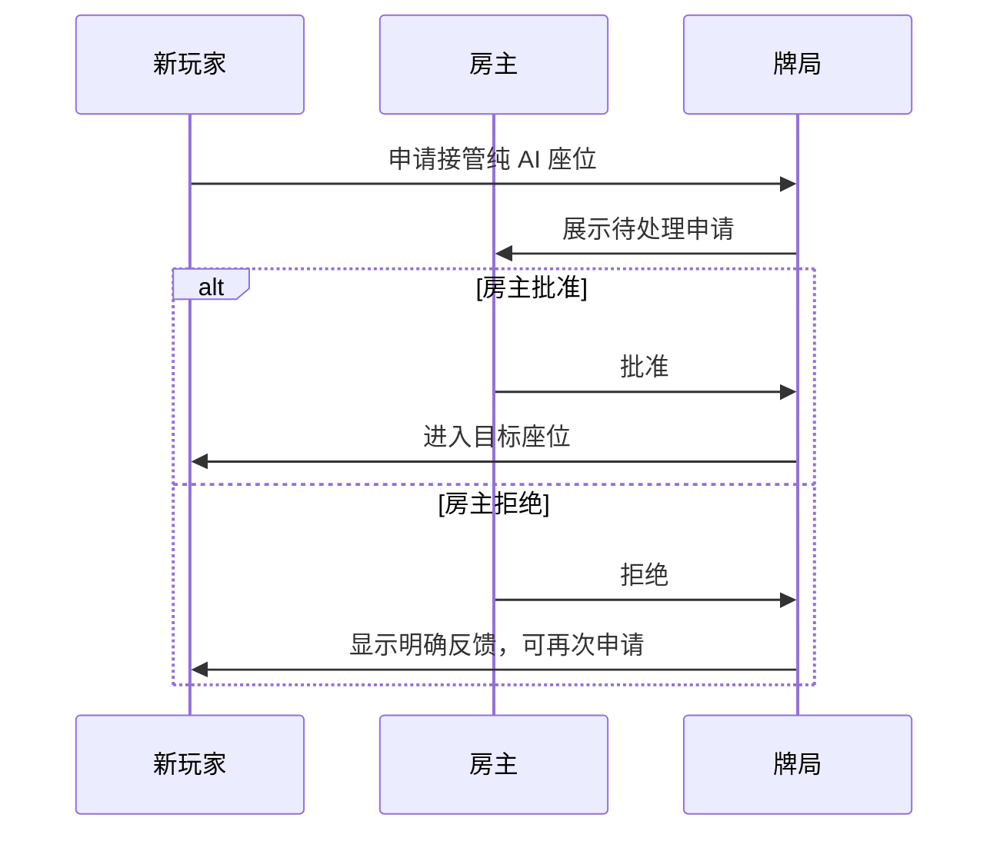

# 房间、重连与接管

联机牌局的难点不是创建一个房间，而是在有人迟到、掉线或离开时，仍然让留在桌上的三个人拥有一局完整的牌。

## 房间从四位人类开始，也能由 AI 补齐

创建者进入第一个座位并成为房主。房间满四人后自动开始；如果有人暂时缺席，房主可以选择让 AI 补位，而不是让所有人停在等待界面。

房主拥有的不是额外的游戏优势，而是桌面秩序的责任：开始补位、处理接管申请、解散尚未开始的房间，以及在整场结束后发起下一局。

## 重连优先恢复“这位玩家”，而不只是一个名字

网络短暂中断不应让玩家丢掉 13 张手牌或回到陌生座位。重连流程优先识别原来的本地身份和恢复凭据，恢复原座位与牌局状态；这比仅靠昵称匹配更可靠，也避免同名玩家误占座。

玩家看到的体验应该是：重新连接后回到正在进行的牌桌，而不是重新创建角色。具体身份校验和凭据实现不会在公开站披露。

## AI 托管：让牌局继续，但不剥夺玩家回来

离线超过宽限时间后，房主可将该座位交给 AI 托管。AI 接手的是临时操作权，不是永久替换：原玩家恢复连接后仍可取回自己的座位和手牌。

这条设计避免了两个坏结果：等待离线玩家导致整桌停摆，或玩家一次网络波动就被永久踢出。

## 纯 AI 座位接管：把公平留给房主

当牌局已经开始且没有空座时，新到的玩家可以申请接管纯 AI 座位。申请不会直接替换 AI，而是交由房主明确批准或拒绝。

这个确认步骤让正在认真进行的牌局不被无预期的人员变化打断，也避免把“可加入”误解成“可以抢走一个正在发挥作用的 AI 座位”。
